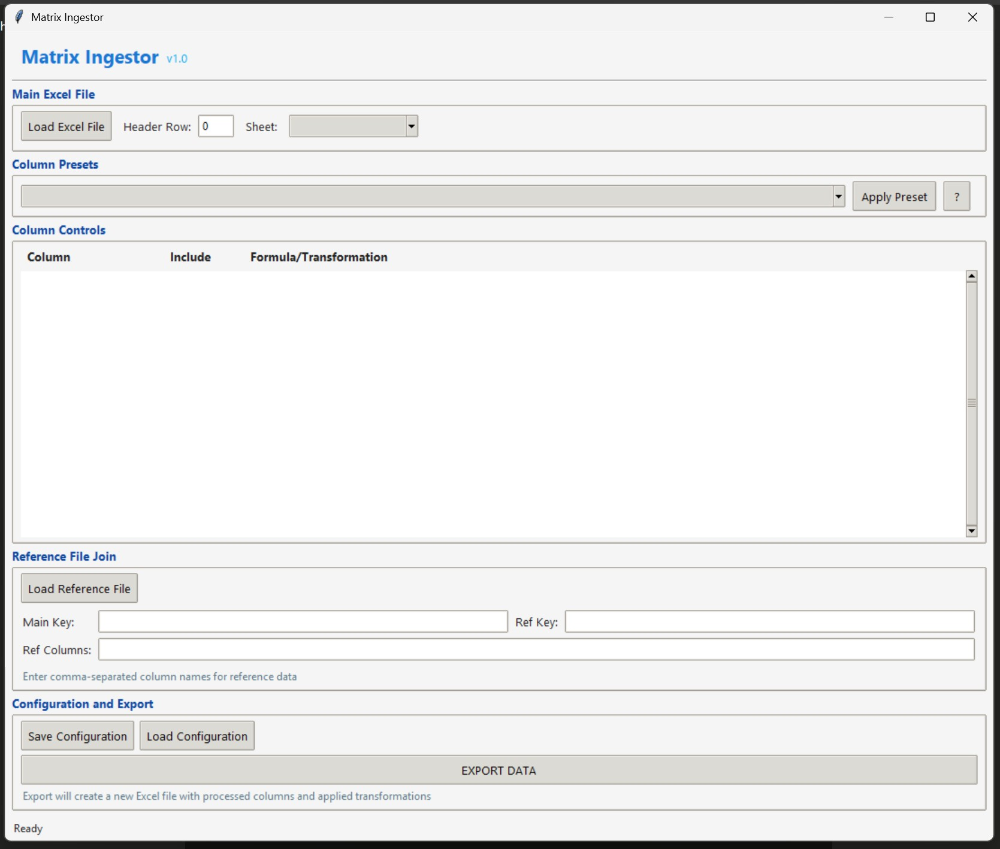
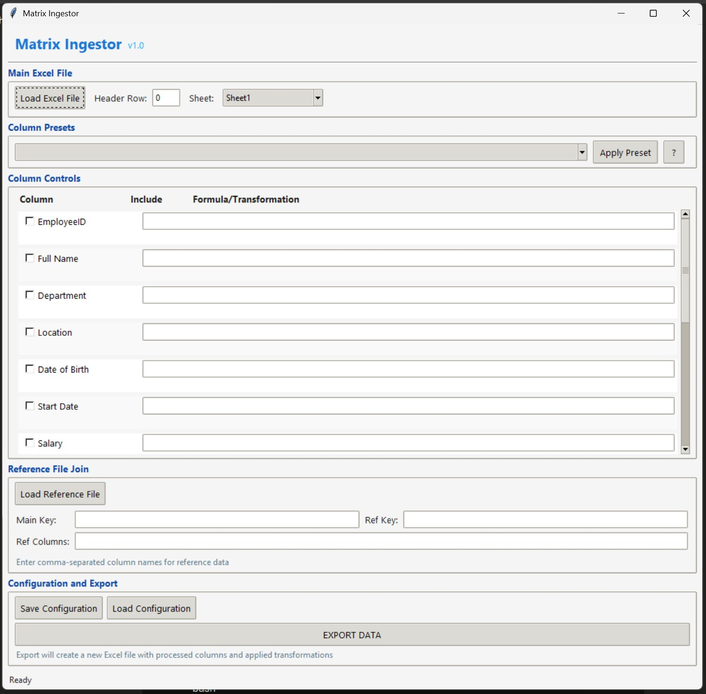

# 🧰 Matrix Ingestor

A powerful, local-first Excel transformation toolkit with a modern UI built using Python and Tkinter.

Matrix Ingestor empowers users to visually manipulate, transform and join Excel data with a polished, intuitive interface.


<!-- 

Matrix Ingestor Interface Screenshot](./docs/scrn02.jpg) -->
Matrix Ingestor Interface Screenshot

<br/>
Matrix Ingestor Interface Screenshot  file loaded


## 🚀 Features

### ✅ Interactive Excel Loading
- Open any `.xlsx` or `.xls` file with intuitive file browser
- Seamlessly navigate multi-sheet workbooks
- Flexible header row configuration
- Automatic column detection and preview

### ✅ Visual Column Management
- Select columns with intuitive checkboxes
- Apply powerful transformations with the enhanced formula editor
- Real-time formula validation and previews
- Support for Python expressions via `pandas.eval()`

### ✅ Advanced Reference Data Joining
- Load and link secondary Excel files
- Define relationships with intuitive key mapping
- Selective column inclusion from reference data
- Left-join operation with clear visual feedback

### ✅ Smart Preset System
- Save frequently used transformations as presets
- Quick-apply column configurations
- Persistent workspace settings
- Streamlined workflow for repeated tasks

### ✅ Enhanced Export Capabilities
- One-click export to clean Excel files
- Visual progress tracking
- Optimized output files
- Comprehensive error handling

### ✨ Modern UI Improvements
- Professional, material design-inspired interface
- Responsive layout that adapts to window size
- Intuitive tooltips and help features
- Streamlined workflow with clear visual hierarchy
- Enhanced status updates with success/error indicators

---

## 🖥️ Technical Details

### Project Structure
```
matrix-ingestor/
├── main.py                # Entry point
├── gui/
│   ├── app.py             # Main application logic
│   ├── core/
│   │   ├── exporter.py    # Export functionality
│   │   ├── formula_engine.py  # Formula processing
│   │   ├── loader.py      # Excel file loading
│   │   └── presets.py     # Preset management
│   └── ui/
│       ├── layout.py      # UI layout builder
│       ├── theme.py       # Theming system
│       ├── utils.py       # UI utilities
│       ├── custom_widgets.py # Enhanced widgets
│       └── __init__.py    # Package initialization
├── assets/                # Application icons/images
├── presets.json           # Saved transformation presets
└── config.json            # Application configuration
```

### Core Components
- **Formula Engine**: Leverages pandas' evaluation capabilities with enhanced syntax
- **Theme System**: Consistent, customizable visual styling
- **Custom Widgets**: Enhanced UI controls for improved user experience
- **Export Pipeline**: Optimized transformation and output generation

---

## 🛠️ Installation

### Prerequisites
- Python 3.7 or higher
- Required packages: pandas, openpyxl, tkinter (usually included with Python)

### Setup

1. Clone the repository:
```bash
git clone https://github.com/yourusername/matrix-ingestor.git
cd matrix-ingestor
```

2. Install required packages:
```bash
pip install pandas openpyxl
```

3. Run the application:
```bash
python main.py
```

---

## 📝 Usage Guide

### Working with Excel Files
1. Click "Load Excel File" to select your main file
2. Choose the appropriate sheet from the dropdown menu
3. Set the header row index if needed (default: 0)
4. The columns will appear in the main panel for configuration

### Transforming Data
- **Include/Exclude Columns**: Toggle checkboxes to select which columns to include
- **Apply Formulas**: Enter transformations in the formula field
  - Reference columns using square brackets: `[Column Name]`
  - Example: `[Price] * 1.15` (applies 15% markup)
  - Example: `[First Name].upper() + " " + [Last Name].upper()` (combines names in uppercase)
  - Example: `"Yes" if [Age] > 18 else "No"` (conditional logic)

### Working with Reference Data
1. Click "Load Reference File" to select a secondary Excel file
2. Enter the column name from your main file in "Main Key"
3. Enter the column name from your reference file in "Ref Key"
4. List the columns to include from the reference file in "Ref Columns" (comma-separated)

### Using Presets
1. Configure your columns and formulas as needed
2. Save the configuration using "Save Config"
3. Later, select from the preset dropdown and click "Apply Preset"

### Exporting Transformed Data
1. Configure all columns and reference joins as needed
2. Click "EXPORT DATA"
3. Choose a location to save the output file
4. The processed data will be exported to a new Excel file

---

## 🤝 Contributing

Contributions are welcome! Feel free to submit issues or pull requests to help improve Matrix Ingestor.

## 📄 License

This project is licensed under the MIT License - see the LICENSE file for details.
